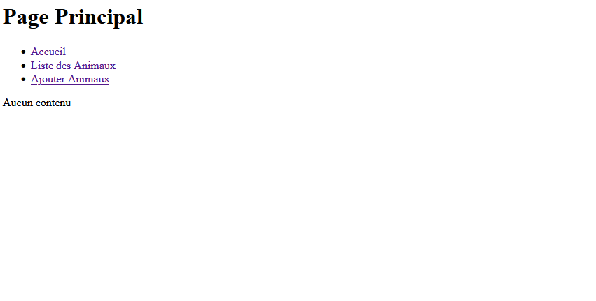
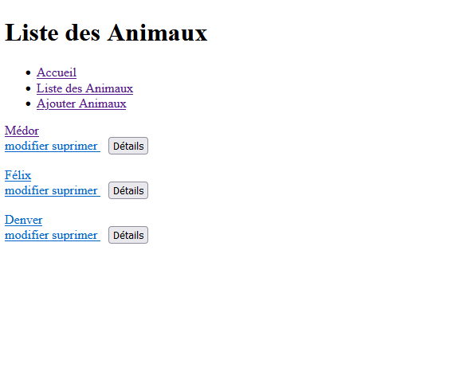
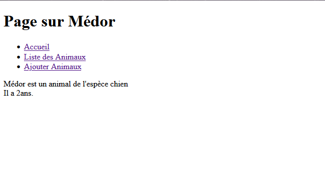
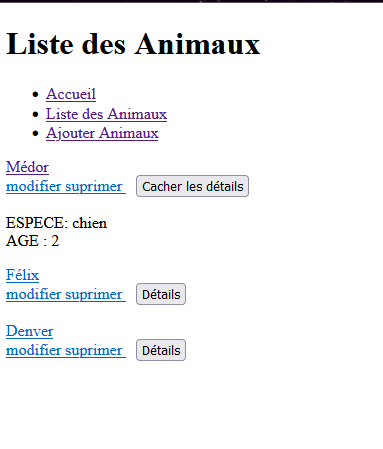
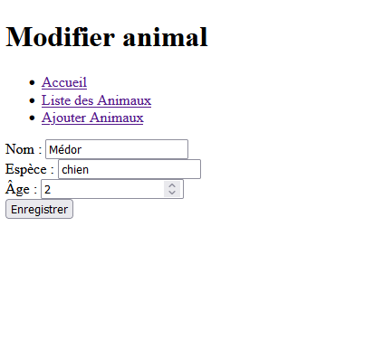
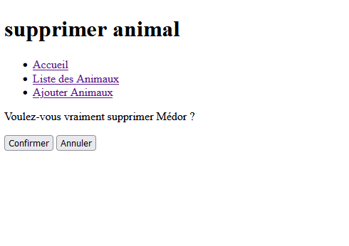
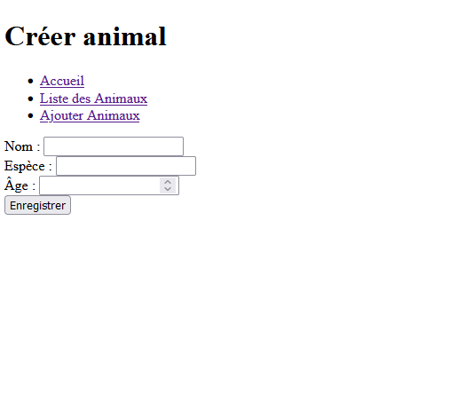

# Site internet qui liste les animaux

Ce site internet à été réalisé seul au 1er semestre de 3eme année de licence Informatique.
Ce site internet comprends totalement ce qui avait été demandé sur le sujet même les compléments.

### Lancement

Ecrire ça dans la console:
php -S localhost:8000

et ça dans le navigateur:
http://localhost:8000/site.php

### Information technique

Ce projet nécessité l'utilisation de javascript pour l'affichage des détails des animaux.
Le reste a été réalisé en utilisant de l'HTML et du PHP.

### Fonctionnalité

Voici a quoi ressemble la page principal:

Voici la page qui affiche la liste des animaux:

Voici la page résultant du clique sur le nom d'un animal:

Voici ce qu'il se passe lorsqu'on clique sur le bouton détails:

Voici ce qu'il se passe lorsqu'on clique sur le bouton modifier:

Voici ce qu'il se passe lorsqu'on clique sur le bouton supprimer:

Voici la page qui affiche la formulaire d'ajout d'un animal:

### Conclusion

Ce projet était très facile à réalisé malgrès qu'il n'y avait que 2 semaines pour le réalisé.
J'aurais pu ajouter de la couleur mais en raison d'autre projet que j'avais en parallèle cela n'a pas été fait.
